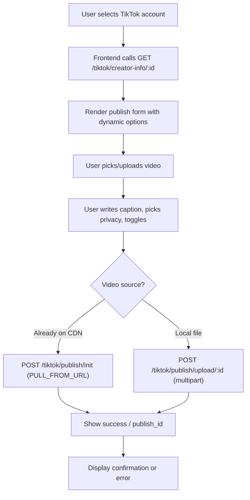

# Frontend Integration Plan: TikTok Video Publishing

## 1. Responsibility Boundary

### Backend owns (the frontend never touches these)

| Concern | Detail |

|---|---|

| TikTok OAuth tokens | `access_token` and `refresh_token` are stored in the DB and never exposed to the client. |

| Token refresh | The backend detects `access_token_invalid` / HTTP 401 from TikTok and retries with a fresh token automatically. The frontend is unaware this happened. |

| TikTok API communication | Every request to `open.tiktokapis.com` is made server-side. The frontend calls **your** backend only. |

| Video streaming to TikTok | For FILE_UPLOAD, the backend receives the file, writes it to a temp directory, streams it in chunks to TikTok's upload URL, and cleans up. |

| Input validation | The backend validates DTOs (`class-validator`) and returns structured 400 errors. |

### Frontend owns

| Concern | Detail |

|---|---|

| Authenticated HTTP calls | Attach the Auth0 Bearer token to every request to the backend. |

| File selection and client-side validation | Check file type (`video/*`), file size (max 4 GB), and duration before uploading. |

| Building the publish form | Render privacy level dropdown, toggle switches, caption field — all driven by creator-info data. |

| Upload progress UX | Show a progress bar during multipart upload to the backend. |

| Optimistic UI and error display | Manage loading states, disable buttons, surface error messages. |

---

## 2. Backend Endpoints Reference

| Method | Path | Purpose | Request | Response (success) |

|---|---|---|---|---|

| `GET` | `/tiktok/creator-info/:socialAccountId` | Fetch creator capabilities | - | `{ success, data: { privacy_level_options, comment_disabled, duet_disabled, stitch_disabled, max_video_post_duration_sec } }` |

| `POST` | `/tiktok/publish/init` | Init a direct post (PULL_FROM_URL or FILE_UPLOAD) | JSON body (see below) | `{ success, data: { publish_id, upload_url? } }` |

| `POST` | `/tiktok/publish/upload/:socialAccountId` | Upload video + publish in one step (FILE_UPLOAD) | `multipart/form-data` (see below) | `{ success, data: { publish_id, message } }` |

### POST `/tiktok/publish/init` — JSON body

```json
{
  "socialAccountId": "clu...",
  "title": "My TikTok video",
  "privacy_level": "PUBLIC_TO_EVERYONE",
  "disable_comment": false,
  "disable_duet": false,
  "disable_stitch": false,
  "source_type": "PULL_FROM_URL",
  "video_url": "https://cdn.example.com/video.mp4"
}
```

### POST `/tiktok/publish/upload/:socialAccountId` — FormData fields

| Field | Type | Notes |

|---|---|---|

| `file` | File | The video file (`video/*` MIME type) |

| `title` | string | Max 150 chars |

| `privacy_level` | string | One of `PUBLIC_TO_EVERYONE`, `MUTUAL_FOLLOW_FRIENDS`, `FOLLOWER_OF_CREATOR`, `SELF_ONLY` |

| `disable_comment` | `"true"` / `"false"` | String because multipart form fields are always strings |

| `disable_duet` | `"true"` / `"false"` | |

| `disable_stitch` | `"true"` / `"false"` | |

---

## 3. User Journey / UX Flow



### Step-by-step

1. **Account selection** — The user picks which connected TikTok account to publish from (the frontend already knows the `socialAccountId` from the user's linked accounts list).

2. **Fetch creator info** — Immediately call `GET /tiktok/creator-info/:socialAccountId`. Cache the result for the duration of the form session. This drives:

   - Which privacy levels appear in the dropdown (only show what `privacy_level_options` contains).
   - Whether the "Allow comments" / "Allow duet" / "Allow stitch" toggles are shown or force-disabled (if `comment_disabled`, `duet_disabled`, or `stitch_disabled` are `true` at the account level, grey-out the toggle and show a tooltip explaining why).
   - Max video duration validation on the client (`max_video_post_duration_sec`).

3. **Video selection** — The user either:

   - **Uploads a file from their device** — triggers the FILE_UPLOAD path.
   - **Has a video already in the platform's CDN (R2)** — triggers the PULL_FROM_URL path (the backend already has the public URL from the Media model).

4. **Caption and settings** — The user writes a title/caption (max 150 characters — enforce with a character counter) and adjusts privacy + toggles.

5. **Publish** — One button click:

   - PULL_FROM_URL: `POST /tiktok/publish/init` with a JSON body.
   - FILE_UPLOAD: `POST /tiktok/publish/upload/:socialAccountId` with `FormData`.

6. **Feedback** — On success, show the `publish_id` and a "Video submitted to TikTok" confirmation. On error, show a user-friendly message.

---

## 4. API Consumption Order

```
1.  GET  /tiktok/creator-info/:socialAccountId
    → Store in local state. Use to build form.
    → Call once when the user enters the "Publish to TikTok" screen.

2a. (PULL_FROM_URL path)
    POST /tiktok/publish/init
    → Send JSON. Done.

2b. (FILE_UPLOAD path)
    POST /tiktok/publish/upload/:socialAccountId
    → Send FormData with the video file + metadata fields.
    → Monitor XMLHttpRequest/fetch upload progress.
    → Done.
```

The frontend does **not** need to call any init endpoint before the upload endpoint — the `/publish/upload` endpoint handles init + upload internally in a single request.

---

## 5. State Management

The frontend should track these state slices for the publish form:

| State | Type | Purpose |

|---|---|---|

| `creatorInfo` | `CreatorInfoData \| null` | Cached response from creator-info. Drives form options. |

| `creatorInfoLoading` | `boolean` | Show skeleton/spinner while fetching creator capabilities. |

| `selectedFile` | `File \| null` | The video file the user picked (if FILE_UPLOAD). |

| `title` | `string` | Caption text, max 150 chars. |

| `privacyLevel` | `string` | Selected privacy level. |

| `disableComment` | `boolean` | Toggle state. |

| `disableDuet` | `boolean` | Toggle state. |

| `disableStitch` | `boolean` | Toggle state. |

| `uploadProgress` | `number` (0-100) | Percentage of bytes sent to the backend (FILE_UPLOAD only). |

| `publishStatus` | `'idle' \| 'uploading' \| 'publishing' \| 'success' \| 'error'` | Current phase of the operation. |

| `publishId` | `string \| null` | The `publish_id` returned on success. |

| `errorMessage` | `string \| null` | User-facing error text. |

This can live in a single component/store — no global state needed unless the publish form is shared across routes.

---

## 6. Error Handling Strategy

### Error categories and frontend reactions

| HTTP Status | Meaning | Frontend Action |

|---|---|---|

| **400** | Validation error (bad title, missing field, wrong privacy level, non-video file) | Parse the response body for the `message` array. Display inline field errors. **Not retryable** — the user must fix input. |

| **401** | Auth0 token expired (your backend auth, not TikTok's) | Redirect to login / trigger silent Auth0 token refresh. |

| **404** | Social account not found or inactive | Show "TikTok account not connected" and link to account settings. |

| **413** | File too large (exceeds 4 GB Multer limit) | Show "Video file is too large. Maximum size is 4 GB." **Not retryable.** |

| **500** | Internal error (TikTok API failure, upload failure) | Show a generic "Something went wrong. Please try again." with a **Retry** button. Log the error for diagnostics. |

### TikTok-specific errors surfaced by the backend

The backend wraps TikTok errors into HTTP 500 or 400 responses. The frontend should check the error message string for known patterns:

| Pattern in error message | User-facing message | Retryable? |

|---|---|---|

| `spam_risk_too_many_posts` | "You've posted too many videos recently. Please wait and try again later." | Yes, after delay |

| `scope_not_authorized` | "Your TikTok account doesn't have permission for this action. Please reconnect your account." | No — requires re-OAuth |

| `rate_limit_exceeded` | "TikTok rate limit reached. Please try again in a few minutes." | Yes, after delay |

| `publish_failed` | "TikTok could not process this video. Please check the format and try again." | Maybe — depends on video |

### Silent retries

The frontend should **not** silently retry on its own. Token refresh is handled transparently by the backend. If the backend returns an error, it has already exhausted its retry logic.

---

## 7. UX and Product Recommendations

### Dynamic option disabling

- **Privacy dropdown**: Only render options present in `creatorInfo.privacy_level_options`. If the array is empty or missing a value, do not show it — never let the user pick a value the backend will reject.
- **Comment / Duet / Stitch toggles**: If `creatorInfo.comment_disabled` is `true`, render the toggle as disabled + OFF with a tooltip: "Comments are disabled on your TikTok account."

### Preventing duplicate submissions

- Disable the "Publish" button immediately on click and change its label to "Publishing..." with a spinner.
- Re-enable only on error or after navigating away and returning.
- Optionally debounce or use an `AbortController` to cancel in-flight requests if the user navigates away.

### Upload progress

- For the FILE_UPLOAD path, use `XMLHttpRequest` (or a fetch wrapper like `axios` with `onUploadProgress`) to track bytes sent to the **backend**.
- Display a determinate progress bar during upload (0-100%).
- Once the upload to the backend completes, switch to an indeterminate spinner with "Submitting to TikTok..." — because the backend is now streaming to TikTok and you have no progress signal for that phase.

### Handling large video files

- Validate file size client-side before uploading: reject files > 4 GB immediately.
- Validate video duration client-side using the `<video>` element's `loadedmetadata` event: compare against `creatorInfo.max_video_post_duration_sec`.
- Validate MIME type client-side: `file.type.startsWith('video/')`.
- Show a warning for files over ~500 MB that the upload may take several minutes.

### Graceful cancellation

- Provide a "Cancel" button during upload. Wire it to an `AbortController.abort()` on the fetch/XHR.
- On cancellation, reset `publishStatus` to `'idle'` and re-enable the form. The backend's temp file cleanup runs in a `finally` block regardless.

### Retry

- On error, show a "Try Again" button that resubmits with the same form state.
- Do **not** reset the form on error — the user should not have to re-fill fields or re-select the video.

---

## 8. Security Considerations

### TikTok tokens never reach the frontend

- The `access_token` and `refresh_token` are stored server-side in the `SocialAccount` table. No backend endpoint returns them.
- The frontend authenticates with **Auth0** only. The backend maps the Auth0 user to their social accounts internally.
- If a token refresh happens during a request, it is invisible to the frontend.

### Frontend communicates only with the backend

- The frontend must **never** call `open.tiktokapis.com` directly. All TikTok communication is proxied through the backend.
- This prevents token leaks, CORS issues, and ensures rate-limit / error-handling logic stays centralized.

### Video uploads go through the backend

- For FILE_UPLOAD, the video is sent to the backend via multipart form-data. The backend then streams it to TikTok.
- This adds latency (double transfer) but is the correct approach because:

  1. TikTok's upload URL requires the OAuth token in the request — the frontend cannot make that call.
  2. The backend handles chunking, retries, and cleanup.

- For large-scale production optimization in the future, consider a pre-signed-upload flow where the backend returns a TikTok upload URL and the frontend uploads directly — but **only** if TikTok's API supports unsigned or pre-authed upload URLs (currently it does not; the Bearer token is required on the PUT).

### CORS

- The backend already has CORS configured for the frontend origin (`https://app.planer.com.ar`). No changes needed.
- Ensure the frontend sends `credentials: 'include'` or the Auth0 Bearer token in the `Authorization` header on every request.